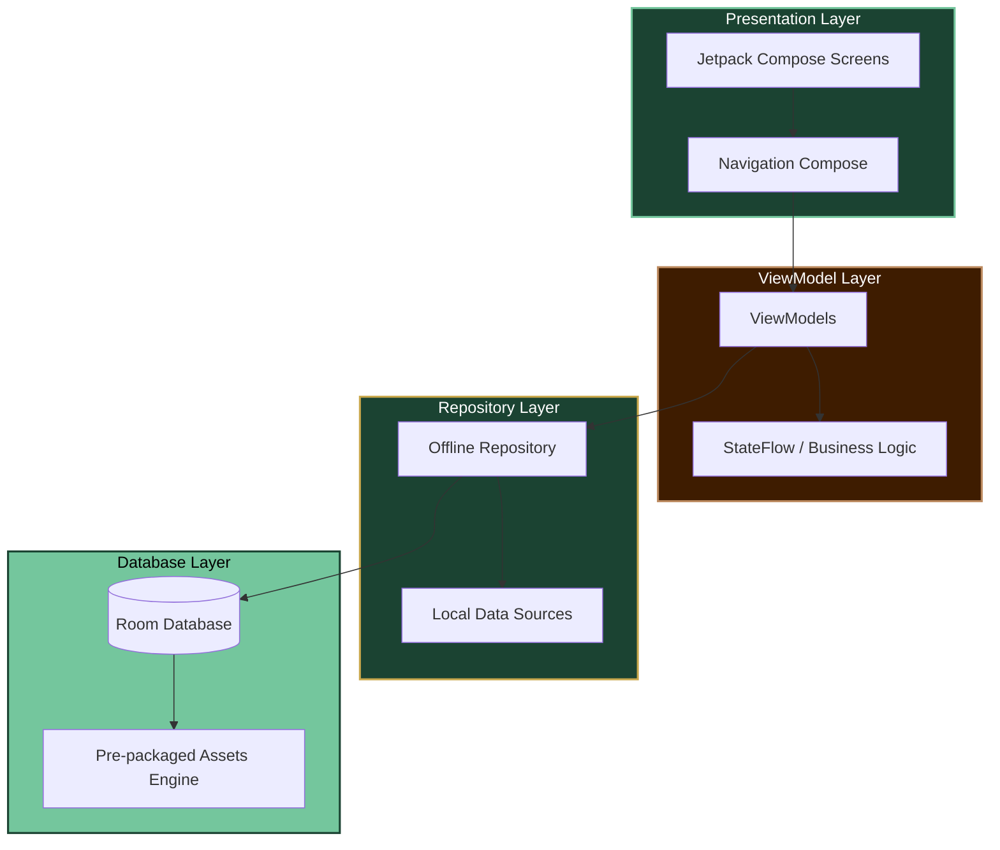
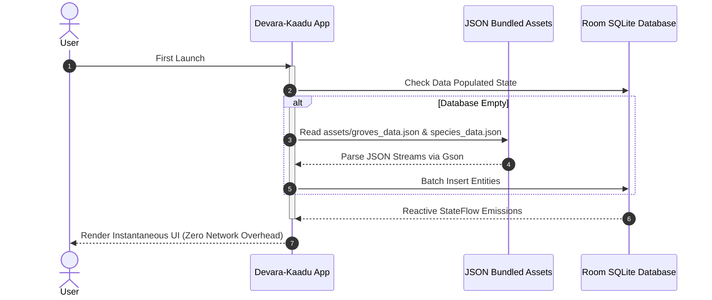

<div align="center">


# 🌿 Devara-Kaadu (ದೇವರ ಕಾಡು)
### Sacred Grove Sentinel

[](https://git.io/typing-svg)

**Offline-First Architecture • GPS Discovery • Biodiversity Awareness • Gamified Engagement**

[](https://www.android.com)
[](https://kotlinlang.org)
[](https://developer.android.com/jetpack/compose)
[](https://developer.android.com/topic/architecture)
[](https://developer.android.com/training/data-storage/room)

---

</div>

## 📖 Executive Summary

**Devara-Kaadu** is an offline-first Android application designed to map, celebrate, and preserve the **Sacred Groves** (*Devara Kaadu / Kaavu / Bana / Nagabana*) of Karnataka. Serving as a living digital bridge between **Traditional Ecological Knowledge** and **Modern Biodiversity Science**, the app operates completely independently of internet connectivity to ensure seamless utility even in remote forest ranges.

---

## 🏛️ System Architecture

The application adopts a highly robust, scalable, and testable **Layered MVVM (Model-View-ViewModel)** framework optimized for offline-first data workflows.



### Layer Breakdown
- **Presentation Layer**: Built natively with **Jetpack Compose** using Material Design 3 guidelines for fluid interactions, interactive animations, and responsive screen states.
- **ViewModel Layer**: Manages configuration-surviving state utilizing **Kotlin Coroutines** and **StateFlow** to emit immutable UI states to the views.
- **Repository Layer**: Acts as the single source of truth, orchestrating local pre-populated asset data synchronization and continuous Room persistence.
- **Database Layer**: Powered by **Room ORM** equipped with highly efficient local query processing.

---

## 📱 Core Modules & Application Showcase

<div align="center">

| Module | Core Functionality | Visual & UX Highlights |
| :--- | :--- | :--- |
| 🏠 **Home Dashboard** | Acts as the **Central Navigation Hub** linking all internal modules. Displays real-time repository stats (Total Groves, Catalogued Species, Guardian Points), dynamic grid action tiles, and a rotating **Eco-Fact** engine. | Rich forest-themed UI tokens, high-contrast accessible layout components, fluid container transform patterns. |
| 🌳 **Grove Directory** | Comprehensive **Sacred Grove Explorer** enabling lightning-fast local lookup. Incorporates reactive live search queries, multi-parameter filtering (by District, Assigned Deity, and Extent Size), and layout rendering toggles (Grid vs. List). | Instantaneous offline indexing, animated search expanding headers, gracefully bounded list adapters. |
| 📋 **Grove Detail Screen** | Deep scientific, cultural, and geographic layout mapping individual sacred groves. Segregates local **Mythological Backgrounds** from concrete **Ecological Indicators** (flora/fauna density, topsoil fidelity). | Premium interactive action hubs allowing users to directly trigger local species discovery, log local issues, or mark visit stamps. |
| 🔬 **Species Scan Simulation** | Advanced prototype workflow mimicking an intelligent **On-Device AI Species Scanner**. Users initiate virtual image analysis targeting unclassified botanical specimens. | Captivating dynamic scan loops, granular identification metrics yielding calculated confidence coefficients, and instant **Guardian Points** issuance. |
| 📍 **GPS Integration** | Real-time **Nearby Grove Detection** utilizing location state flows. Processes geodetic inputs to spotlight adjacent sacred sanctuaries along with sorted path proximity ranges. | Integrates the mathematical **Haversine Formula** over standard sensor listeners, coupled with intuitive fallback protocols for permissions. |
| 🛡️ **Guardian Mode** | Gamified conservation engagement hub encouraging sustainable, active learning. Tracks accrued merit points to grant milestone badges (**Explorer**, **Protector**, **Sentinel**) alongside activity timelines. | Gorgeous badge icon layouts, progress ring visual indicators, and transparent ledger histories. |
| ⚠️ **Conservation Alerts** | Offline-capable reporting engine allowing community sentinels to log immediate forest threats (Forest Fires, Illegal Timber Operations, Toxic Waste Leaks) for synchronization upon network restoration. | Clear priority tags, automated geographical pinning, and localized persistent offline queues. |

</div>

---

## 🗃️ Offline Engine & Database Lifecycle



### Entity Relationship Model
- **`Groves` Table**: Primary keys mapped to district-specific coordinates, folklore textual logs, and spatial properties.
- **`Species` Table**: Catalogues cross-referenced biological entities containing localized trilingual tags (Kannada, English, Scientific).
- **`Alerts` Table**: Maintains timestamped user hazard dispatches.
- **`User Progress` Table**: Persists gamification indices natively.

---

## 🛠️ Technical Stack & Dependencies

- **Language**: Core standard **Kotlin** (1.9+) utilizing expressive idioms.
- **Asynchronous Engine**: Fully structured **Kotlin Coroutines** paired with cold/hot **Flow** primitives.
- **UI Toolkit**: Modern **Jetpack Compose** (Material 3 components, Custom Theming Tokens).
- **Navigation**: Dedicated **Navigation Compose** leveraging strong type-safety and distinct screen routes.
- **Persistence Framework**: Jetpack **Room Database** integrated with asynchronous transaction DAOs.
- **Location Subsystem**: Google Mobile Services **FusedLocationProviderClient** for optimal fine/coarse tracking.
- **Asset Parsing**: Google **Gson** mapping declarative object assets.

---

## 📈 Results, Challenges & Future Scope

### Results Achieved
- **100% Standalone Readiness**: Accomplished zero-latency loading screens without runtime API timeouts.
- **13 Interactive Modules**: Seamless structural navigation handling broad contextual data layouts.
- **Optimized UI/UX Fidelity**: Custom color matrices delivering state-of-the-art dark/light forest aesthetics.

### Engineering Challenges Overcome
- **KSP Interoperability**: Formulated optimized DAO abstract definitions preventing multi-layer type erasures.
- **Complex UI Coordination**: Decoupled domain business objects from view states via comprehensive mapping components.
- **Asset Serialization**: Implemented buffered thread pools to prevent frame drops during initial asset provisioning routines.

### Future Scope & Evolutionary Roadmap
- [ ] **On-Device TensorFlow Lite Integration**: Transforming the simulated image analyzer into real-time local edge vision models.
- [ ] **Vector Tile Offline Maps**: Rendering dedicated local spatial rasters directly inside detail nodes.
- [ ] **Secure Cryptographic Synchronization**: Encrypted syncing pipelines to back up alerts to distributed central repositories.
- [ ] **Community Verification Portals**: Peer-reviewed edits verifying external ecological inputs.

---

## 🚀 Getting Started & Build Instructions

### Prerequisites
- **IDE**: Android Studio Hedgehog (2023.1.1) or newer.
- **JDK Version**: Java Development Kit 17.
- **Android Target**: API Level 34 (Minimum API 26).

### Execution Steps

1. **Clone the Source Repository**:
   ```bash
   git clone https://github.com/your-username/DevaraKaadu.git
   ```
2. **Open the Project**: Launch Android Studio, select `File > Open`, and target the cloned project directory.
3. **Synchronize Dependencies**:
   ```bash
   ./gradlew --refresh-dependencies
   ```
4. **Compile Debug Bundle**:
   ```bash
   ./gradlew assembleDebug
   ```
5. **Deploy to Target Device**: Connect an Android 8.0+ hardware device or emulator and launch:
   ```bash
   ./gradlew installDebug
   ```

> [!NOTE]
> **First-Launch Provisioning Time**: The application executes an optimized initialization phase upon first cold boot to inject bundled JSON assets directly into the localized SQLite storage layers. This executes within ~600 milliseconds, ensuring fully decoupled local responses for all future app usage cycles.

---

## 🎨 Premium Visual Theme Tokens

To maintain absolute harmony with nature, the UI relies on custom token matrices:

- **Deep Canopy Green** (`#1B4332`): Primary active headers and navigational bars.
- **Sprout Sage** (`#74C69D`): Dynamic action accents and active state focus elements.
- **Bark Umber** (`#3E1C00`): Secondary card containers and structural text frameworks.
- **Sacred Ochre** (`#C9A84C`): Icon highlights, reward status metrics, and focal tags.
- **Warm Parchment** (`#F8F3E6`): Core app ambient canvas backdrops ensuring outstanding daylight visibility.

---

## 🤝 Contribution Guidelines

We highly encourage contributions from software developers, environmental researchers, and local folklore enthusiasts! Please view our standard pull request workflow templates and ensure all new UI components incorporate predefined **Material Theme Tokens** alongside robust offline verification states.

---

<div align="center">


### *"ಕಾಡು ಉಳಿದರೆ ನಾಡು ಉಳಿಯುತ್ತದೆ"*
**If the forest survives, the land survives.**

Built with passion for Karnataka's Sacred Groves. 🌳✨

</div>
