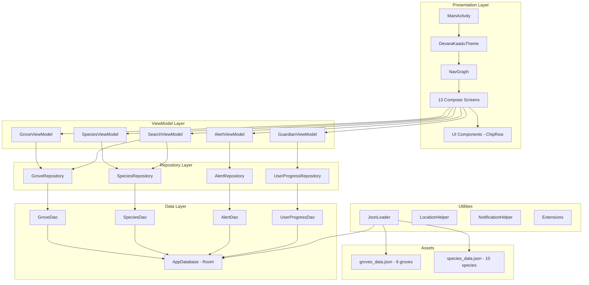
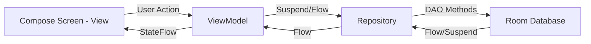
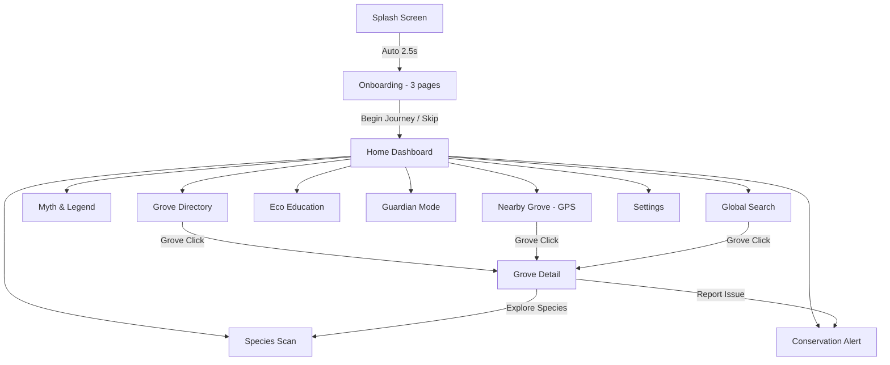
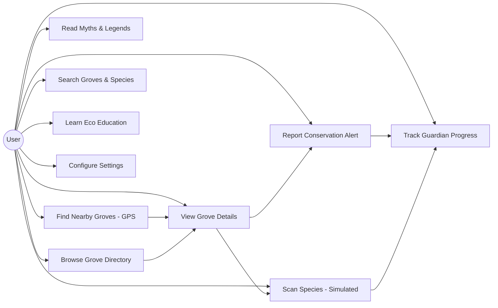

# CHAPTER 15: SYSTEM ARCHITECTURE

## 15.1 High-Level Architecture Diagram



*[Insert Figure 5.1: System Architecture Diagram — render the above Mermaid diagram]*

**Figure 5.1** — Complete system architecture showing the layered MVVM pattern with Presentation, ViewModel, Repository, Data, and Utility layers.

## 15.2 MVVM Architecture Flow



*[Insert Figure 5.2: MVVM Data Flow Diagram]*

**Figure 5.2** — MVVM data flow showing unidirectional data flow from View → ViewModel → Repository → Database and reactive updates back via Kotlin Flow and StateFlow.

## 15.3 Navigation Flowchart



*[Insert Figure 5.3: Application Navigation Flowchart]*

**Figure 5.3** — Navigation flow showing all 13 screens and their interconnections. Splash → Onboarding → Home is a one-way flow. Home serves as the central hub.

## 15.4 Application Class

The `DevaraKaaduApp` class extends `Application` and serves as the manual dependency injection container:

```kotlin
class DevaraKaaduApp : Application() {
    val database by lazy { AppDatabase.getDatabase(this) }
    val groveRepository by lazy { GroveRepository(database.groveDao()) }
    val speciesRepository by lazy { SpeciesRepository(database.speciesDao()) }
    val alertRepository by lazy { AlertRepository(database.alertDao()) }
    val userProgressRepository by lazy { UserProgressRepository(database.userProgressDao()) }

    override fun onCreate() {
        super.onCreate()
        NotificationHelper.createNotificationChannel(this)
        NotificationHelper.scheduleDailyReminder(this)
    }
}
```

> **Note (Prototype Implementation):** Dependency injection is done manually through the Application class rather than using Hilt/Dagger. This is a deliberate simplification for the prototype. Production systems should adopt Hilt for testability and scalability.

## 15.5 Screen Route Definitions

All navigation routes are defined as a sealed class:

```kotlin
sealed class Screen(val route: String) {
    object Splash : Screen("splash")
    object Onboarding : Screen("onboarding")
    object Home : Screen("home")
    object GroveDirectory : Screen("grove_directory")
    object GroveDetail : Screen("grove_detail/{groveId}") {
        fun createRoute(groveId: Int) = "grove_detail/$groveId"
    }
    object SpeciesScan : Screen("species_scan")
    object MythLegend : Screen("myth_legend")
    object NearbyGrove : Screen("nearby_grove")
    object ConservationAlert : Screen("conservation_alert")
    object GuardianMode : Screen("guardian_mode")
    object EcoEducation : Screen("eco_education")
    object Settings : Screen("settings")
    object Search : Screen("search")
}
```

## 15.6 Use Case Diagram



*[Insert Figure 9.1: Use Case Diagram]*

**Figure 9.1** — Use case diagram showing all user interactions with the Devara-Kaadu system.

---
---

# CHAPTER 16: APPLICATION MODULES

**Table 5.1: Application Module Summary**

| # | Module | File | ViewModel | Database |
|---|--------|------|-----------|----------|
| 1 | Splash Screen | `SplashScreen.kt` | None | None |
| 2 | Onboarding | `OnboardingScreen.kt` | None | None |
| 3 | Home Dashboard | `HomeScreen.kt` | None | None |
| 4 | Grove Directory | `GroveDirectoryScreen.kt` | `GroveViewModel` | `groves` table |
| 5 | Grove Detail | `GroveDetailScreen.kt` | `GroveViewModel` | `groves` table |
| 6 | Species Scan | `SpeciesScanScreen.kt` | `SpeciesViewModel` | `species` table |
| 7 | Myth & Legend | `MythLegendScreen.kt` | None | Hardcoded data |
| 8 | Nearby Grove | `NearbyGroveScreen.kt` | `GroveViewModel` | `groves` table |
| 9 | Conservation Alert | `ConservationAlertScreen.kt` | `AlertViewModel` | `alerts` table |
| 10 | Guardian Mode | `GuardianModeScreen.kt` | `GuardianViewModel` | `user_progress` table |
| 11 | Eco Education | `EcoEducationScreen.kt` | None | Hardcoded data |
| 12 | Search | `SearchScreen.kt` | `SearchViewModel` | `groves` + `species` |
| 13 | Settings | `SettingsScreen.kt` | None | None |

---

## Module 1: Splash Screen

**Purpose:** Brand introduction with animated visuals on app launch.

**Features:**
- Animated app logo with scale + alpha transitions using `Animatable`
- Three concentric pulsing ring animations using `rememberInfiniteTransition`
- Radial gradient gold-to-brown logo circle with 🌿 emoji
- App title "Devara-Kaadu" in Sacred Gold
- Subtitle "Sacred Grove Sentinel" with letter spacing
- Kannada title "ದೇವರಕಾಡು"
- Bottom tagline "Preserving Karnataka's Sacred Forests"
- Auto-navigates to Onboarding after ~2.5 seconds

**Technical Implementation:**
- Uses Compose `Animatable` for alpha (0→1) and scale (0.7→1.0) with spring damping
- `LaunchedEffect(Unit)` triggers animation sequence
- Vertical gradient: `ForestGreen900` → `ForestGreen800` → `ForestGreen700`
- Navigates with `popUpTo(inclusive=true)` to prevent back navigation to splash

**Navigation:** Splash → Onboarding (one-way, splash removed from back stack)

*[Insert Figure 6.1: Splash Screen Screenshot]*

**Figure 6.1** — Splash screen showing the animated forest-themed branding with concentric ring animations and the Kannada title.

---

## Module 2: Onboarding

**Purpose:** Three-page guided introduction to the app's mission.

**Features:**
- `HorizontalPager` with 3 swipeable pages
- Page 1: "Protect Sacred Groves" (🌳) — Forest green gradient
- Page 2: "Learn Biodiversity" (🦋) — Earth brown gradient
- Page 3: "Become Guardian of Nature" (🛡️) — Green-gold gradient
- Animated dot indicators with width transition (8dp → 28dp)
- Skip button and Next/Begin Journey button
- Each page has Kannada subtitle text
- `AnimatedVisibility` with slide-in and fade-in effects
- Semi-transparent description cards

**Technical Implementation:**
- `rememberPagerState(pageCount = 3)` for swipe navigation
- `animateDpAsState` for page indicator dot width animation
- `animateScrollToPage` for programmatic navigation
- Each page has unique gradient colors defined in `OnboardingPage` data class

**Navigation:** Onboarding → Home (one-way, onboarding removed from back stack)

*[Insert Figure 6.2: Onboarding Screens (3 pages shown side-by-side)]*

**Figure 6.2** — Three onboarding pages: Protect Sacred Groves, Learn Biodiversity, and Become Guardian.

---

## Module 3: Home Dashboard

**Purpose:** Central navigation hub and app landing page.

**Features:**
- Top app bar with "Devara-Kaadu" title and Settings icon
- Hero banner with Kannada greeting "ನಮಸ್ಕಾರ 🙏"
- Quick stats row (2,000+ Sacred Groves | 5,000+ Species | 40% Water Recharge)
- 8-card dashboard grid with gradient backgrounds
- Each card has emoji icon, title, subtitle, and route
- Card press animation (scale 0.95→1.0)
- Eco Fact of the Day card with random ecological fact
- Parchment background color scheme

**Dashboard Cards:**
1. 🌳 Grove Directory — Explore Sacred Sites
2. 🔬 Species Scan — Identify Native Plants
3. 📜 Myth & Legend — Sacred Stories
4. ⚠️ Conservation Alert — Report Issues
5. 📍 Nearby Grove — GPS Detection
6. 🌱 Eco Education — Learn & Protect
7. 🛡️ Guardian Mode — Earn Badges
8. 🔍 Global Search — Find Anything

**Technical Implementation:**
- `dashboardItems` list maps to `DashboardItem` data class with route, colors, text
- Grid rendered manually with `Row` and `chunked(2)` (not `LazyGrid` — inside scrollable `Column`)
- `animateFloatAsState` for card press animation

**Navigation:** Home → All 8 feature screens + Settings

*[Insert Figure 6.3: Home Dashboard Screenshot]*

**Figure 6.3** — Home dashboard showing the hero banner, quick stats, 8 feature cards in grid layout, and eco fact card.

---

## Module 4: Grove Directory

**Purpose:** Browsable, searchable, filterable catalog of sacred groves.

**Features:**
- Search bar with clear button
- Filter chips: All, Kaavu, Bana, Nagabana, Devarakadu, Kans Forest
- Toggle between grid view and list view
- Results count display
- Grid cards with gradient backgrounds, grove type chip, name, location
- List cards with grove icon, name, location, type chip, visited indicator
- Visited groves show green checkmark

**Technical Implementation:**
- `GroveViewModel` manages `searchQuery`, `selectedType`, `isGridView` as `MutableStateFlow`
- `combine(_searchQuery, _selectedType).flatMapLatest()` for reactive filtering
- `GroveDao.searchGroves()` uses SQL LIKE queries across name, village, district, deity
- `LazyVerticalGrid(columns=GridCells.Fixed(2))` for grid mode
- `LazyColumn` for list mode
- `collectAsStateWithLifecycle()` for lifecycle-aware state collection

**Database Interaction:** Reads from `groves` table via `GroveRepository` → `GroveDao`

*[Insert Figure 6.4: Grove Directory — Grid View]*
*[Insert Figure 6.5: Grove Directory — List View]*

**Figure 6.4/6.5** — Grove directory in grid and list modes showing search, filter chips, and grove cards.

---

## Module 5: Grove Detail

**Purpose:** Comprehensive information page for a single sacred grove.

**Features:**
- Hero banner with grove type chip, name, village, district, deity
- Quick facts row: GPS coordinates, tree count, area in hectares
- Sacred Legend & Tradition card (mythology section)
- Scientific & Ecological Facts card (science section)
- Native species chips (horizontal scrollable)
- Bird species chips (horizontal scrollable)
- Rare medicinal plants section
- Action buttons: Become Guardian, Explore Species, Report Issue
- Mark as visited functionality

**Technical Implementation:**
- `GroveViewModel.loadGroveById(id)` loads grove via `suspend fun getGroveById()`
- JSON arrays in `nativeSpeciesJson` and `birdSpeciesJson` parsed with Gson
- `ChipRow` reusable composable for species/bird chip lists
- `SectionCard` reusable composable for expandable info sections
- `markAsVisited()` updates both `groves` table and `user_progress` table

**Database Interaction:** Reads from `groves` table; writes to `groves.isVisited` and `user_progress.grovesVisited`

*[Insert Figure 6.6: Grove Detail Screen]*

**Figure 6.6** — Grove detail showing hero banner, quick facts, separated mythology and science sections, species chips, and action buttons.

---

## Module 6: Species Scan (Simulated Feature)

**Purpose:** Proof-of-concept AI species identification using local database.

**Features:**
- Scanner viewfinder with corner brackets and animated scan line
- Pulse animation during scanning
- "Scan Species" button triggering 2.4-second simulated analysis
- Linear progress bar during scan
- Result card showing: name, scientific name, Kannada name, type, conservation status, medicinal use, ecological role, sacred association, fun fact
- Instructions card when idle
- Clear scan button

**Technical Implementation (Prototype):**
- `SpeciesViewModel.simulateScan()` runs in `viewModelScope.launch`
- Animated progress: `repeat(20) { delay(120); progress = (i+1)/20f }`
- Result: `allSpecies.value.random()` — picks random species from database
- Awards 30 points via `userProgressRepository.incrementSpeciesScanned()`
- Viewfinder uses `rememberInfiniteTransition` for scan line Y-position animation

> **⚠️ Simulated Feature:** The species scanner does NOT use real AI/ML. It selects a random species from the local database to simulate identification. In production, this would be replaced with a TensorFlow Lite model for actual image classification.

*[Insert Figure 6.7: Species Scan Screen — Idle State]*
*[Insert Figure 6.8: Species Scan Screen — Result Card]*

**Figure 6.7/6.8** — Species scan viewfinder in idle state and after successful simulated identification showing complete species data.

---

## Module 7: Myth & Legend

**Purpose:** Storytelling interface for sacred grove oral histories.

**Features:**
- `ScrollableTabRow` with 3 legend tabs (Igguthappa, Marikamba, Vasuki)
- Hero banner with deity name, grove name, district
- Full legend story in long-form prose (oral history style)
- Living Traditions card with cultural practices
- Parchment-colored story cards

**Technical Implementation:**
- Legends data hardcoded as `List<Legend>` in screen file (3 detailed stories)
- `ScrollableTabRow` for deity selection
- `selectedLegend` state controls displayed content
- No ViewModel or database — purely static content

> **Note (Prototype Implementation):** Legend data is hardcoded in the screen composable. In production, this should be moved to the database or JSON assets for scalability.

*[Insert Figure 6.9: Myth & Legend Screen]*

**Figure 6.9** — Myth & Legend screen showing tab-based navigation, hero section, and immersive storytelling card.

---

## Module 8: Nearby Grove (GPS)

**Purpose:** GPS-based proximity detection for nearby sacred groves.

**Features:**
- Radar animation with concentric pulse rings
- Permission request card for location access
- "Find Nearby Sacred Groves" button
- User coordinates display
- Sorted list of nearby groves by distance
- Distance display in km
- Special highlight for groves within 500m
- Fallback to Bangalore coordinates for demo

**Technical Implementation:**
- `Accompanist Permissions` library for runtime permission management
- `LocationHelper.getCurrentLocation()` uses `FusedLocationProviderClient`
- `suspendCancellableCoroutine` wraps location callback as coroutine
- `LocationHelper.distanceMeters()` uses `Location.distanceBetween()` (Haversine)
- Groves filtered to within 50km, sorted by distance
- Fallback: If location unavailable, uses Bangalore coords (12.9716°N, 77.5946°E) for demo

> **Note (Prototype Implementation):** GPS detection works with actual device location when available. Demo mode falls back to Bangalore coordinates. The 50km radius is generous for demonstration purposes.

*[Insert Figure 6.10: Nearby Grove Screen — GPS Radar and Results]*

**Figure 6.10** — Nearby grove screen showing radar animation, user coordinates, and sorted list of groves by proximity.

---

## Module 9: Conservation Alert

**Purpose:** Offline threat reporting system for sacred grove issues.

**Features:**
- Report form with issue type selector (7 categories via `AlertType` enum)
- Issue types: Tree Cutting, Waste Dumping, Fire Risk, Encroachment, Poaching, Water Pollution, Other
- Description text field (6-line multiline)
- Submit button with loading indicator
- Success confirmation card
- History toggle showing all past reports
- Alert history cards with type icon, description, status, timestamp
- Delete functionality for alerts

**Technical Implementation:**
- `AlertViewModel.submitAlert()` creates `Alert` entity and inserts via `AlertRepository`
- Each alert records: type, description, timestamp, status ("Pending")
- `incrementAlertsReported()` awards 40 points to Guardian progress
- `getAllAlerts()` returns `Flow<List<Alert>>` ordered by timestamp descending
- History view shows all locally stored alerts with formatted dates

**Database Interaction:** Writes to `alerts` table; reads for history view; deletes on user action

*[Insert Figure 6.11: Conservation Alert — Report Form]*
*[Insert Figure 6.12: Conservation Alert — History View]*

**Figure 6.11/6.12** — Conservation alert form with issue type selector and history view showing past reports.

---

## Module 10: Guardian Mode

**Purpose:** Gamified progress tracking with badge system.

**Features:**
- Guardian hero banner with shield emoji
- Impact stats: Groves Visited, Species Scanned, Alerts Filed, Legends Read, Total Points
- Points progress bar with milestone targets (50, 150, 300, 1000)
- 6 badges with earned/locked states
- Badge details: icon, title, description, required points, trophy/lock icon

**Badges (as implemented in `Badge` enum):**
1. 🌿 Sacred Grove Explorer — Visit 1 grove (50 pts)
2. 🦋 Biodiversity Protector — Scan 5 species (150 pts)
3. 🛡️ Nature Guardian — Report 3 alerts (200 pts)
4. ⚔️ Eco Warrior — Visit 5 groves (300 pts)
5. 📜 Legend Keeper — Read 10 legends (250 pts)
6. 🌟 Sacred Sentinel — Earn all other badges (1000 pts)

**Technical Implementation:**
- `GuardianViewModel` observes `UserProgress` via `Flow`
- `UserProgressRepository.checkAndAwardBadges()` auto-evaluates after each point-earning action
- Badges stored as JSON array of badge names in `badgesEarnedJson` field
- `parseBadgeNames()` uses Gson to deserialize badge list
- Single-row table pattern: `user_progress` always has `id=1`

**Database Interaction:** Reads/writes `user_progress` table

*[Insert Figure 6.13: Guardian Mode Screen]*

**Figure 6.13** — Guardian mode showing impact statistics, points progress bar, and badge collection with earned/locked states.

---

## Module 11: Eco Education

**Purpose:** Educational content about sacred grove ecology.

**Features:**
- Hero banner with "Learn why Sacred Groves matter"
- 6 expandable accordion topic cards
- Topics: What are Sacred Groves, Biodiversity Hotspots, Water Recharge Systems, Micro-Climate Regulation, Carbon Storage, Traditional Ecological Knowledge
- Each topic has detailed multi-paragraph content
- Karnataka Sacred Grove Facts card with 6 verified statistics
- Expand/collapse toggle with chevron icons

**Technical Implementation:**
- Topics hardcoded as `List<EcoTopic>` data class
- `expandedIndex` state manages single-expansion accordion pattern
- No ViewModel — purely informational static content

*[Insert Figure 6.14: Eco Education Screen]*

**Figure 6.14** — Eco education screen with expandable topic cards and Karnataka fact card.

---

## Module 12: Global Search

**Purpose:** Unified search across groves and species databases.

**Features:**
- Debounced search input (300ms delay)
- Combined results: Sacred Groves section + Species section
- Grove results show name, village, district, type
- Species results show name, scientific name, Kannada name
- Empty state with search icon
- No results message

**Technical Implementation:**
- `SearchViewModel` uses `_query.debounce(300).flatMapLatest()` for both grove and species search
- `GroveDao.searchGroves()` searches across name, village, district, deity fields
- `SpeciesDao.searchSpecies()` searches across name, scientificName, kannadaName
- Results displayed in `LazyColumn` with keyed items

*[Insert Figure 6.15: Search Screen]*

**Figure 6.15** — Global search showing combined grove and species results.

---

## Module 13: Settings

**Purpose:** App configuration and information.

**Features:**
- App info card (version, offline status)
- Appearance section: Dark Mode toggle, Kannada Language toggle
- Experience section: Nature Sounds toggle (coming soon), Conservation Reminders toggle
- Information section: About, Privacy Policy, Data Storage, Open Source Credits
- Guardian's Pledge conservation oath card

> **⚠️ Prototype Implementation:** Toggle states (dark mode, Kannada language, nature sounds) are managed as local `remember` states and do NOT persist across app restarts. They demonstrate the UI pattern but are not connected to actual DataStore or theme switching logic. The notification toggle is also UI-only.

*[Insert Figure 6.16: Settings Screen]*

**Figure 6.16** — Settings screen with appearance toggles, experience options, and Guardian's Pledge.

