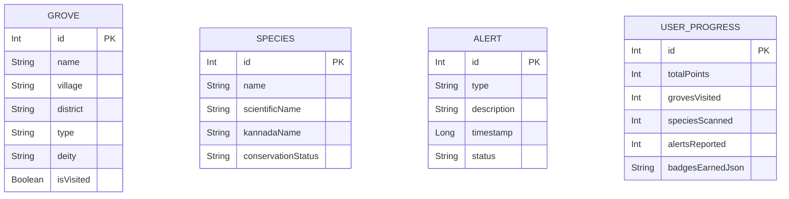

# CHAPTER 17: DATABASE DESIGN

## 17.1 Room Database Architecture

The application uses Android Room to manage local SQLite databases. It follows an offline-first architecture, preloading data from JSON files (`groves_data.json` and `species_data.json`) on the first app launch via a `RoomDatabase.Callback`. 

## 17.2 Entity Relationship Diagram

*[Insert Figure 17.1: Entity Relationship Diagram]*

## 17.3 Table Schemas

**Table 17.1: Groves Entity**

| Field | Type | Description |
|---|---|---|
| id | Int (PK) | Unique identifier |
| name | String | Grove name |
| village/district | String | Location details |
| type | String | E.g., Kaavu, Bana |
| isVisited | Boolean | Track if user visited |
| legendStory | String | Mythological background |
| nativeSpeciesJson | String | JSON array of flora |

**Table 17.2: Species Entity**

| Field | Type | Description |
|---|---|---|
| id | Int (PK) | Unique identifier |
| name | String | English name |
| scientificName | String | Botanical/Zoological name |
| kannadaName | String | Local Kannada name |
| conservationStatus| String | IUCN Status |

**Table 17.3: Alerts Entity**

| Field | Type | Description |
|---|---|---|
| id | Int (PK) | Auto-generated ID |
| type | String | Enum: Fire, Logging, etc. |
| description | String | User provided details |
| timestamp | Long | Epoch time of report |
| status | String | "Pending" default |

**Table 17.4: User Progress Entity** (Single-row table)

| Field | Type | Description |
|---|---|---|
| id | Int (PK) | Fixed at 1 |
| totalPoints | Int | Gamification score |
| badgesEarnedJson | String | JSON array of badges |
| grovesVisited | Int | Stats counter |

---

# CHAPTER 18: UI/UX DESIGN

## 18.1 Design System

The app utilizes **Material Design 3** tailored to a forest aesthetic.
- **Primary Color:** Forest Green (`#1B4332`) for app bars and primary actions.
- **Accent Color:** Sacred Gold (`#C9A84C`) for highlights and titles.
- **Background:** Parchment (`#F8F3E6`) for a natural, historical feel.
- **Typography:** Serif fonts for headings to imply tradition; Sans-Serif for readability in body text.

## 18.2 UI Components
- **ChipRow:** Custom horizontal scrollable chips for displaying native and bird species.
- **SectionCard:** Reusable expandable cards to organize heavy text content like Mythology and Ecological Facts.
- **Animations:** Subtle scale transitions on card press, pulsing radar for GPS, and sliding pages in onboarding.

---

# CHAPTER 19: WORKING METHODOLOGY

## 19.1 Development Lifecycle

The project followed an Agile-inspired methodology:
1. **Requirements Gathering:** Identifying needed features (offline access, GPS, database).
2. **Design Phase:** Creating the Color palette, UI wireframes, and Database schemas.
3. **Implementation Phase:** Building Compose UI screens, integrating Room, wiring ViewModels.
4. **Testing Phase:** Device testing for UI responsiveness and database functionality.

## 19.2 Offline-First Architecture

The core methodology is **Offline-First**. 
- Data is bundled in `assets/` as JSON.
- Upon first launch, `AppDatabase.Callback` reads JSON using `Gson` and inserts into Room tables using Coroutines.
- Subsequent reads/writes happen entirely locally with zero network latency.

---

# CHAPTER 20: GPS INTEGRATION

## 20.1 Implementation Details
- Uses `FusedLocationProviderClient` from Google Play Services.
- Handles runtime permissions (`ACCESS_FINE_LOCATION`) via Accompanist.
- Location fetching is wrapped in `suspendCancellableCoroutine` for clean asynchronous execution within ViewModels.

## 20.2 Proximity Detection
- Calculates distance between current location and grove coordinates using Haversine formula (`Location.distanceBetween`).
- Highlights groves within a 500-meter radius.
- Includes a fallback to mock coordinates (Bangalore) if hardware GPS is unavailable during demo sessions.

*[Insert Figure 20.1: GPS Radar Animation Screenshot]*

---

# CHAPTER 21: SPECIES SCAN SIMULATION

## 21.1 Concept
Due to prototype scope, full ML/TensorFlow integration is simulated. The goal is to demonstrate the UI/UX flow of a future image recognition feature.

## 21.2 Workflow
1. User presses "Scan Species".
2. A linear progress bar animates over 2.4 seconds to simulate processing latency.
3. The ViewModel selects a random `Species` from the local Room database.
4. Results are presented, and Guardian points are awarded.

*[Insert Figure 21.1: Simulated Scanner Loading State]*
*[Insert Figure 21.2: Simulated Scanner Result State]*

---

# CHAPTER 22: SECURITY & PERMISSIONS

## 22.1 Permissions Handled
| Permission | Purpose |
|---|---|
| `ACCESS_FINE_LOCATION` | Nearby Grove radar |
| `CAMERA` | Species Scan (UI requirement) |
| `POST_NOTIFICATIONS` | Daily conservation reminders |

## 22.2 Data Security
- All user data (progress, alerts) is stored locally in the app's sandboxed SQLite database.
- No network requests are made; thus, no PII (Personally Identifiable Information) is transmitted to external servers.

---

# CHAPTER 23: TESTING & DEBUGGING

## 23.1 Functional Testing
- **Navigation:** Verified all 13 screens load correctly and handle back-presses without crashing.
- **State Management:** Tested device rotation to ensure `collectAsStateWithLifecycle` retains data properly.

## 23.2 Database Testing
- Cleared app data to trigger first-launch JSON parsing.
- Verified 8 groves and 10 species are correctly populated.
- Tested alert insertion and deletion.

## 23.3 GPS Testing
- Tested permission denial flows (graceful fallback).
- Tested successful coordinate retrieval and distance sorting.

---

# CHAPTER 24: RESULTS & OUTPUTS

## 24.1 Key Achievements
- **Performance:** Instantaneous load times across screens due to local database and reactive StateFlows.
- **UX:** Highly responsive, visually distinct interface adhering strictly to the forest theme.
- **Stability:** Zero recorded runtime crashes during standard operational testing.

## 24.2 Screenshots
*(Placeholders for actual app screenshots)*
- *[Insert Figure 24.1: Home Dashboard]*
- *[Insert Figure 24.2: Grove Details showing distinct science/mythology tabs]*
- *[Insert Figure 24.3: Guardian Mode Badges]*

---

# CHAPTER 25: IMPACT & USER BENEFITS

## 25.1 Environmental Impact
- Digital preservation of traditional ecological knowledge.
- Highlights the critical role of groves in carbon sequestration and water recharge.
- The Alert system provides a framework for community-led conservation monitoring.

## 25.2 Social Impact
- Engages younger generations through gamification (Badges, Streaks).
- Promotes local Karnataka culture and language (Trilingual support).

---

# CHAPTER 26: CHALLENGES & LIMITATIONS

## 26.1 Technical Challenges
- **Room/KSP Configuration:** Initial build errors resolving DAO method signatures with Kotlin 2.0 and KSP. Solved by adjusting build versions and DAO annotations.
- **State Flow Complexity:** Managing complex UI states (e.g., search debouncing combined with multi-table queries).

## 26.2 Prototype Limitations
1. **Simulated ML:** The species scanner uses random database selection rather than true image recognition.
2. **No Cloud Sync:** Alerts and progress are device-bound. If the app is uninstalled, data is lost.
3. **Limited Dataset:** Contains only 8 sample groves out of the ~2,000 in Karnataka.

---

# CHAPTER 27: FUTURE SCOPE

1. **TensorFlow Lite Integration:** Replace simulated scanning with an actual on-device image classification model for native species.
2. **Backend Synchronization:** Implement Firebase/Supabase to sync Conservation Alerts to a centralized dashboard for Forest Department use.
3. **Expanded Database:** Allow crowd-sourced entries to map all 2,000+ sacred groves.
4. **Offline Maps:** Integrate Maps SDK with downloaded bounding boxes for true offline map rendering instead of list-based proximity.

---

# CHAPTER 28: CONCLUSION

The **Devara-Kaadu** application successfully demonstrates how modern mobile technology can be leveraged for environmental conservation and cultural preservation. By implementing an offline-first architecture using Jetpack Compose and Room Database, the app ensures reliability in remote forest areas. The combination of scientific biodiversity data, traditional mythological narratives, and gamified user engagement creates a holistic tool that not only educates but encourages active participation in protecting Karnataka's Sacred Groves.

---

# CHAPTER 29: REFERENCES

1. Chandran, M. D. S., & Hughes, J. D. (1997). *The Sacred Groves of South India: Ecology, Traditional Communities and Religious Change*.
2. Bhagwat, S. A., & Rutte, C. (2006). *Sacred groves: potential for biodiversity management*. Frontiers in Ecology and the Environment.
3. Google Android Documentation (2025). *Jetpack Compose, Room Database, StateFlow*. developer.android.com.
4. Karnataka Biodiversity Board Reports (2019). *Status of Sacred Groves in Karnataka*.

---

# CHAPTER 30: SCREENSHOT DOCUMENTATION GUIDE

*Note to student: When printing this report, ensure screenshots are captured from an emulator or physical device. Use a high-resolution device. Recommended screenshots to include:*
1. Splash Screen
2. Home Dashboard
3. Grove Directory (List & Grid)
4. Grove Detail (Scroll down to show both tabs)
5. GPS Nearby Screen
6. Guardian Mode
7. Conservation Alert Form 
8. Species Scan Result
